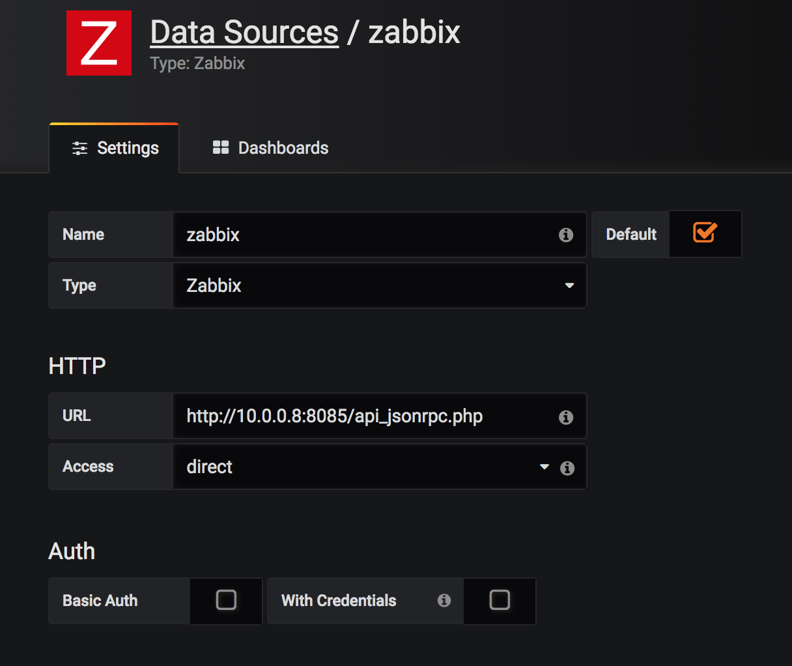
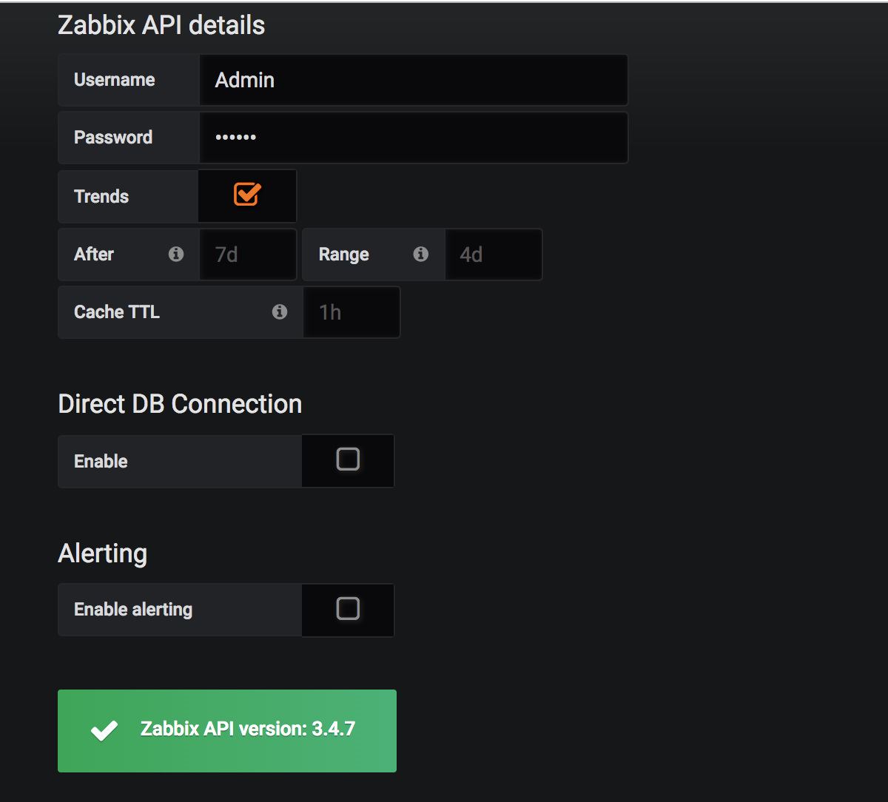

## Document Objective
- Install and configure Grafana in docker
- Integrate with an existing remote LDAP

#### Reference
- [https://www.digitalocean.com/community/tutorials/how-to-install-and-configure-grafana-to-plot-beautiful-graphs-from-zabbix-on-centos-7](https://www.digitalocean.com/community/tutorials/how-to-install-and-configure-grafana-to-plot-beautiful-graphs-from-zabbix-on-centos-7)

- [http://docs.grafana-zabbix.org/installation/](http://docs.grafana-zabbix.org/installation/)

## Launch Grafana in docker


- Compose yaml

```
version: "3"

services:
  grafana:
    image: grafana/grafana
    hostname: grafana
    environment:
    - GF_SERVER_ROOT_URL=<granfana_ip>
    - GF_SECURITY_ADMIN_PASSWORD=xxxxxx
    - GF_INSTALL_PLUGINS=grafana-clock-panel,grafana-simple-json-datasource
    volumes:
    - grafana_lib:/var/lib/grafana
    - grafana_etc:/etc/grafana
    ports:
    - 3000:3000
    deploy:
      placement:
        constraints: [node.labels.host==01]
      replicas: 1

volumes:
  grafana_lib:
  grafana_etc:
```
> Notice: if no specification for "ADMIN_PASSWORD", the default would be "admin".

- Launch

```
docker stack deploy -c /data/yaml/grafana.yaml grafana
```

- Configure OpenLDAP part in Grafana

1. Enable LDAP Auth in [```/etc/grafana/grafana.ini```](../conf/grafana/grafana.ini)

```
######################## Auth LDAP ##########################
[auth.ldap]
enabled = true
config_file = /etc/grafana/ldap.toml
allow_sign_up = true
```

2. Specify LDAP in [```/etc/grafana/ldap.toml```](../conf/grafana/ldap.toml)

```
[[servers]]
# Ldap server host (specify multiple hosts space separated)
host = "10.0.1.10"
# Default port is 389 or 636 if use_ssl = true
port = 389
# Set to true if ldap server supports TLS
use_ssl = false
# Set to true if connect ldap server with STARTTLS pattern (create connection in insecure, then upgrade to secure connection with TLS)
start_tls = false
# set to true if you want to skip ssl cert validation
ssl_skip_verify = false
# set to the path to your root CA certificate or leave unset to use system defaults
# root_ca_cert = "/path/to/certificate.crt"

# Search user bind dn
bind_dn = "cn=admin,dc=dddddd,dc=cn"
# Search user bind password
# If the password contains # or ; you have to wrap it with triple quotes. Ex """#password;"""
bind_password = 'ldap_admin_pass'

# User search filter, for example "(cn=%s)" or "(sAMAccountName=%s)" or "(uid=%s)"
search_filter = "(uid=%s)"

# An array of base dns to search through
search_base_dns = ["dc=dddddd,dc=cn"]
```
- Log in via web, by using LDAP user

http://10.0.0.8:3000

> 用户名：admin    密码：xxxxxx


> 报错误时常用命令:
> docker volume ls
> docker inspect ...
>docker stack ps <stack grafana> --no-trunc
>进入容器 docker exec -it <containersID> /bin/Bash.

>删除volume 后，再启 stack 会重建volume 。 如果 volume 中内容或目录错误，重启 stack 时，volume 中内容不会更新 ，因为已经有 volume 了，只有删除volume，重启stack时 ，volume才会重建。

## Integrate with Zabbix

- Install Zabbix plugin

```
grafana-cli plugins install alexanderzobnin-zabbix-app
```
Need to restart Grafana container, by re- run stack deploy, as plugin installed in /var/lib already configured in persistent volume.

- Configuring the Zabbix Plugin

Log in to the Grafana web interface by navigating to the address http://your_zabbix_server_ip_address:3000.
The default login credentials are admin/dynalink.



<br>
<br>


