## git 在Windows系统中的使用

### 1.git下载及安装

官网 http://git-scm.com/downloads 下载windows版git

打开安装包，开始安装，安装过程如下：

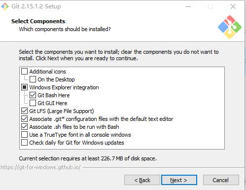


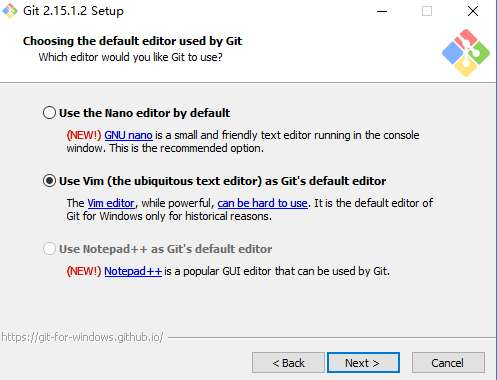


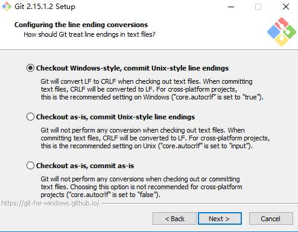

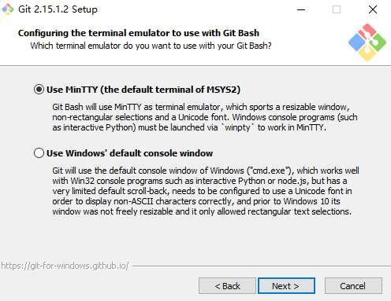

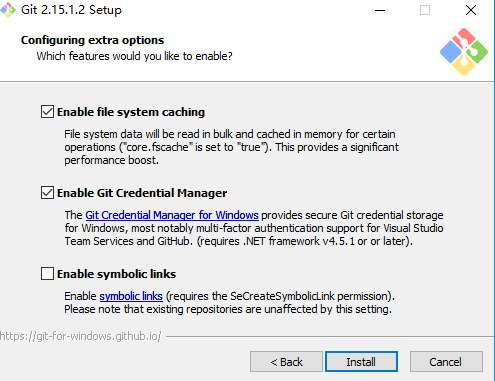

### 2. git bash 配置

先去自行创建gitlab账号，然后进行如下操作

##### 2.1 检查SSH keys是否存在

输入下面的命令，如果有文件id_rsa.pub 或 id_dsa.pub，则直接进入步骤2.3将SSH key添加到Gitlab中，否则进入下一步生成SSH key

```
ls -al ~/.ssh
```

##### 2.2 生成新的 SSH KEY
```
ssh-keygen -t rsa -C "123@qq.com" //这里是gitlab的邮箱
```
路径选择：使用该命令之后, 会出现提示选择ssh-key生成路径,选择在根目录下（默认会在相应路径下（/your_home_path）生成 id_rsa 和 id_rsa.pub 两个文件）

密码确认：这里我们不使用密码进行登录, 用密码太麻烦，直接回车。当然，如果你想使用密码登录，那就输入密码之后回车。

##### 2.3 将 ssh key 添加到 Gitlab 和 gerrit 中

输入下面命令可复制 id_rsa.pub 文件中的 SSH key，将这些复制到 Gitlab 和 gerrit 的 Add SSH key 页面即可(注，页面具体操作见下 3.Gitlab 和 gerrit 中添加 ssh key)。

```
clip < ~/.ssh/id_rsa.pub
```

##### 2.4 配置个人信息，键入指令

```
git config --global user.name "primo" //这里是使用gitlab的用户名
git config --global user.email "123@qq.com" //这里是gitlab的邮箱
```

### 3. Gitlab 和 gerrit 中添加 ssh key

##### 3.1 Gitlab 中添加 ssh key

登录 gitlab ,点击右上角用户头像，点击 **Setting**


进入设置界面，点击 **SSH Keys**

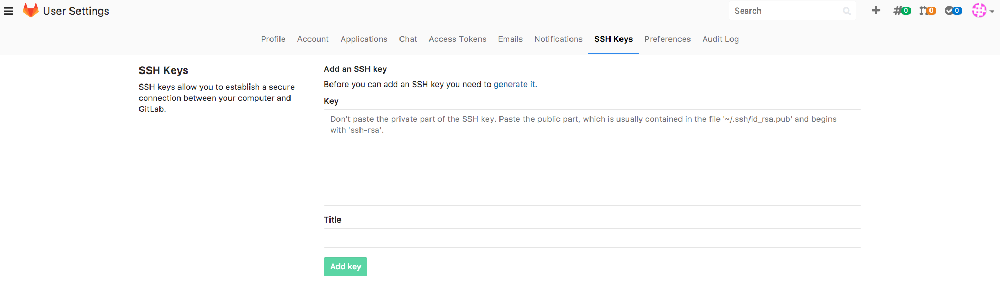

将复制好的ssh-key粘贴到 **Key** ,点击 **Add key**，添加成功


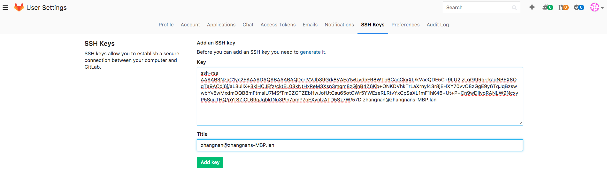


##### 3.2 gerrit 中添加 ssh key

登录 gerrit ,点击右上角用户名，点击 **Setting**


进入设置界面，点击 **SSH Public Keys** --> **Add Key** ,将复制好的ssh-key粘贴到 **Add SSH Public Key** ,点击 **Add**,添加成功

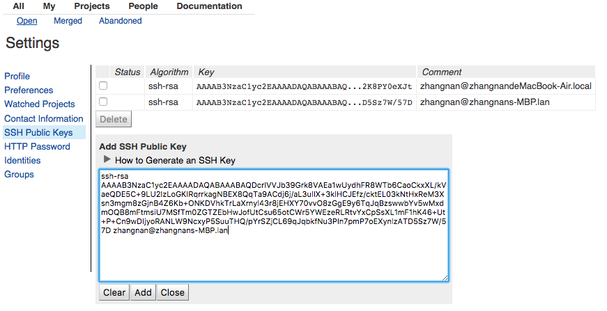


### 4. git-review 的安装

##### 4.1 首先安装Python以安装git-review

4.1.1 登录 https://www.python.org/downloads/ 下载python

4.1.2 安装时保持Python安装在默认目录（如C：\ Python27），而不是安装在任何其他目录。

4.1.3 windows环境下面配置pip环境变量:前提是设置python脚本目录的环境变量，假设python的安装路径为c:\python2.6，则修改我的 **电脑** --> **属性** --> **高级** --> **环境变量** --> **系统变量** ，添加

```
变量名: python //变量名可随意
变量值: c:\python2.6  //使用浏览文件的方式找到安装好的python不容易写错路径
```
在系统变量中的Path添加环境变量

```
%python%  //即变量名
```
对于2.7及以上版本，python 将自动安装 pip。

##### 4.2 在 Git Bash 使用以下命令安装 git-review：

```
pip install git-review
```

### 5. gitlab 中创建项目

为便于项目的分组管理，要先创建 Group ，点击 **New Group**


填写 Group 名及 **Description** ，然后点击 **Create group**


创建完成并进入新 Group ,点击 **New project** 来创建新项目

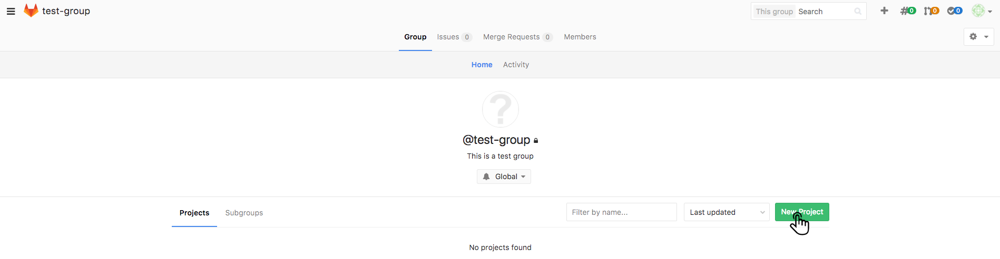

填写 **Project name** 及 **Project description** ,点击 **Create project**


创建完成的项目如下图，点击复制图标即可复制项目的ssh地址

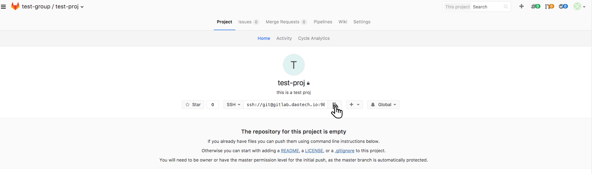

### 6. gerrit 中创建项目

gerrit中点击 **Projects** --> **Create New Project** 来创建项目


填写 **Project name** ( gerrit 中 Project name 须与gitlab中项目名相同),选择 **Rights Inherit From**,点击 **Create Project**


创建完成的项目如下图

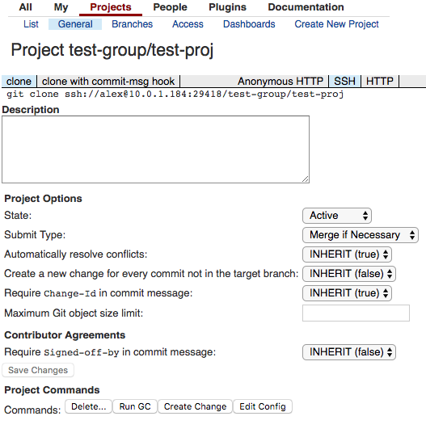


### 7. git 基本命令行

注，命令行在git bash 中运行

##### 7.1 仓库克隆

```
 git clone <ssh-url> //git项目ssh地址，从gitlab中获取
```
##### 7.2 添加gerrit远程仓库

```
git remote add gerrit <gerrit-url> // gerrit的ssh地址，从gerrit中获取
```
##### 7.3 代码上传流程

```
1.将代码加入暂存区
git add -A
2.提交代码至本地工作区
git commit -m ‘your commit message’ -a
3.上传代码至gerrit中
git review
4.获取最新代码
git pull --rebase
```

### 8. gerrit 中代码审核

提交代码后，审核人员要对修改的代码进行审核。登录 gerrit 进入 **All**-->**Open** ，可看到有新提交的项目，点击项目名称


进入审核的界面。**File Path** 中显示的是进行过修改的文件，点击文件名称

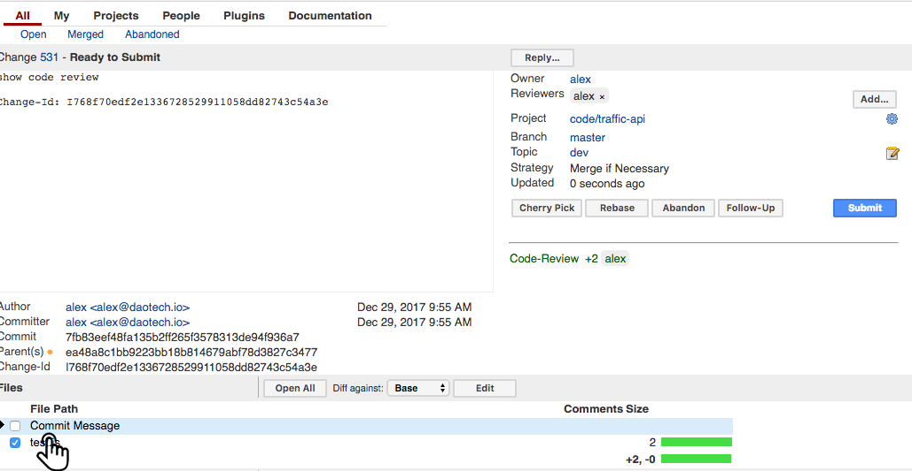

进入修改的文件页面，审核者可以在此看到提交人员的具体修改内容


在审核界面，**0** 表示审核通过代码，**-1**、**-2** 表示审核不通过，点击 **Post**

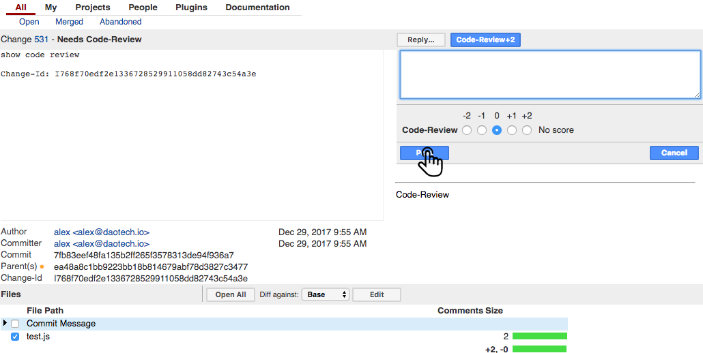

点击 **Submit** 提交审核，审核通过后提交人员修改的代码会进入gerrit中的项目里，审核不通过则提交的代码不能进入 gerrit 的项目中


